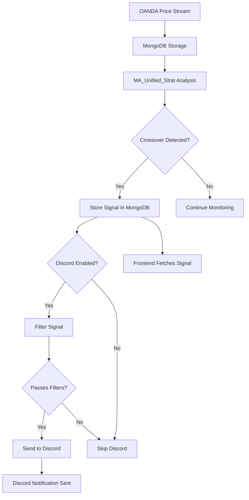

# Discord Live Signal Integration Guide

This guide explains how to enable Discord notifications for live trading signals generated by your MA Unified Strategy running on DigitalOcean.

## 🏗️ Architecture Overview

```
DigitalOcean Droplet:
├── stream_prices.py      → Fetches OANDA data → MongoDB
├── MA_Unified_Strat.py   → Detects crossovers → MongoDB + Discord
└── Discord Integration   → Sends rich notifications
```

## 🚀 Integration Flow

1. **Price Streaming**: `stream_prices.py` continues to stream live prices from OANDA to MongoDB
2. **Signal Detection**: `MA_Unified_Strat.py` detects moving average crossovers
3. **Signal Storage**: Valid signals are stored in MongoDB (existing functionality)
4. **Discord Notification**: **NEW** - Immediately after storing, signals are sent to Discord
5. **Frontend Display**: Your frontend continues to fetch and display signals from MongoDB

## 🔧 Setup Steps

### 1. Environment Variables (Add to your droplet)

```bash
# Discord Configuration
export DISCORD_WEBHOOK_URL="https://discord.com/api/webhooks/YOUR_WEBHOOK_URL"
export DISCORD_NOTIFICATIONS_ENABLED="true"

# Signal Filtering (Optional)
export DISCORD_MIN_RR_RATIO="1.5"
export DISCORD_MIN_CONFIDENCE="0.7"
export DISCORD_ENABLED_PAIRS="EUR/USD,GBP/USD,USD/JPY,AUD/USD"
export DISCORD_ENABLED_TIMEFRAMES="H1,H4,D"

# Rate Limiting (Optional)
export DISCORD_MAX_SIGNALS_PER_MINUTE="5"
export DISCORD_PAIR_COOLDOWN_MINUTES="15"
```

### 2. Discord Server Setup

#### Create Discord Server:
1. Create a new Discord server or use existing
2. Create channels:
   - `#signals-premium` (high confidence signals)
   - `#signals-standard` (medium confidence)
   - `#signals-free` (all signals)
   - `#alerts-critical` (system alerts)

#### Setup Webhook:
1. Go to Server Settings → Integrations → Webhooks
2. Create new webhook for `#signals-premium`
3. Copy webhook URL to `DISCORD_WEBHOOK_URL` environment variable

### 3. Deploy Updated Code

Upload the modified files to your droplet:
- `src/strategies/MA_Unified_Strat.py` (updated with Discord integration)
- `src/config/discord_config.py` (new configuration file)

### 4. Restart Strategy

```bash
# On your DigitalOcean droplet
cd /path/to/your/4ex.ninja-backend
python3 -m venv venv
source venv/bin/activate
pip install -r requirements.txt

# Install additional Discord dependencies if needed
pip install aiohttp

# Restart your strategy
python3 src/strategies/MA_Unified_Strat.py
```

## 📱 What You'll See in Discord

### Sample Signal Notification:
```
🚨 BUY Signal - EUR/USD

💰 Entry Price: 1.1050
🎯 Take Profit: 1.1150 (+100 pips)
🛑 Stop Loss: 1.1000 (-50 pips)
📊 Risk/Reward: 2.0
⏰ Session: London Open
📈 Confidence: High (85%)

Strategy: MA Unified Strategy
Timeframe: H4
Fast MA: 50 | Slow MA: 200
ATR: 0.0025 | Volatility: Medium
```

## 🎛️ Configuration Options

### Signal Filtering
- **Minimum Risk/Reward**: Only send signals with RR ≥ 1.5
- **Minimum Confidence**: Only send signals with confidence ≥ 70%
- **Enabled Pairs**: Filter which currency pairs send notifications
- **Enabled Timeframes**: Filter which timeframes send notifications

### Channel Routing
- **Premium Channel**: High confidence (≥80%) + RR ≥ 2.0
- **Standard Channel**: Medium confidence (≥60%) + RR ≥ 1.5
- **Free Channel**: All qualifying signals

### Rate Limiting
- **Max 5 signals per minute**: Prevents spam
- **15-minute cooldown per pair**: Prevents duplicate notifications
- **Max 30 signals per hour**: Overall limit

## 🧪 Testing

Run the test script to verify Discord integration:

```bash
cd /path/to/your/4ex.ninja-backend
python3 test_discord_live_signals.py
```

Expected output:
```
🧪 Testing Discord Signal Notification...
📊 Signal Analysis:
   Should Send to Discord: True
   Channel Tier: premium
   Risk/Reward: 2.0
   Confidence: 0.85
📤 Sending test signal to Discord...
✅ Discord notification sent successfully!
🎉 Integration test PASSED
```

## 🔄 Process Flow



## 🚨 Error Handling

The integration includes comprehensive error handling:

- **Discord Service Down**: Signals still stored in MongoDB, Discord failures logged
- **Network Issues**: Automatic retries with exponential backoff
- **Rate Limiting**: Built-in rate limiting prevents Discord API abuse
- **Invalid Signals**: Validation ensures only quality signals are sent

## 📊 Monitoring

Monitor Discord integration health:

```python
# Check Discord notification metrics
metrics_collector.get_counter("discord_notifications_sent")
metrics_collector.get_counter("discord_notifications_failed")
```

## 🔧 Troubleshooting

### Common Issues:

1. **No Discord notifications**:
   - Check `DISCORD_WEBHOOK_URL` environment variable
   - Verify Discord server permissions
   - Check signal filtering settings

2. **Too many notifications**:
   - Adjust rate limiting settings
   - Increase minimum risk/reward ratio
   - Reduce enabled pairs/timeframes

3. **Wrong channel routing**:
   - Review channel tier configuration
   - Adjust confidence score thresholds
   - Check signal quality metrics

### Debug Logs:
```bash
# Check strategy logs
tail -f /path/to/logs/strategy.log

# Look for Discord-related messages
grep -i discord /path/to/logs/strategy.log
```

## 🎯 Success Criteria

After successful integration, you should see:

✅ **Live signals in Discord** within 5 seconds of detection  
✅ **Rich formatted notifications** with all signal details  
✅ **Proper channel routing** based on signal quality  
✅ **Rate limiting** preventing spam  
✅ **Error handling** maintaining system stability  
✅ **Continued frontend functionality** (MongoDB signals)  

## 🔮 Future Enhancements

Once basic integration is working, consider:

- **Interactive Discord bot** with slash commands
- **Signal performance tracking** in Discord
- **User subscription management** through Discord
- **Real-time chart images** attached to signals
- **Community features** for signal discussion

---

## ⚡ Quick Start

1. Set `DISCORD_WEBHOOK_URL` environment variable
2. Deploy updated `MA_Unified_Strat.py` 
3. Restart strategy process
4. Monitor Discord channel for notifications
5. Enjoy live trading signals in Discord! 🎉
